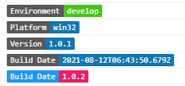
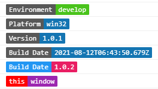

# @sunday9787/log

> 美化log日志输出

## Install

Using npm:

```sh
npm install @sunday9787/log --save
```

or using yarn:

```sh
yarn add @sunday9787/log --dev
```

## Example

特殊类型日志

```js
log('develop', 'env')
log('win32', 'platform')
log('1.0.1', 'version')
log(new Date().toISOString(), 'build')
log('1.0.2', 'build', ['#2196f3', '#e91e63'])
```



自定义 日志输出

```js
log({ label: 'this', message: 'window' }, ['red', '#9c27b0'])
```


